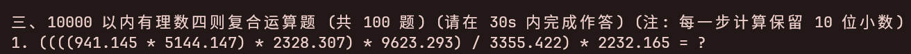
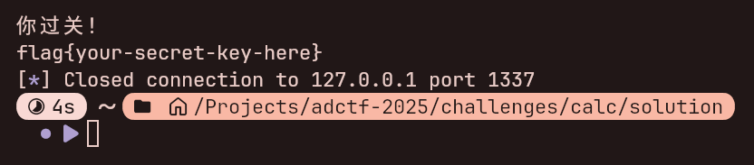

# 听题作答

## 题目描述

> （参考文献：听声辨位）

铜人试炼第一大题：计算题。

算不出来？该罚！

## 引入

在我们上学期和计院团委合作举办的 CTF 也有类似的题目，所以这次炒炒冷饭，加强难度，再出一个 (x)。

我是没想到这道题会 0 解的，也没看到有人报告说这道题有问题，直到快结束了有人报告了才知道有那道乘除题漏给条件了 QwQ。

## 解题思路

根据第一大题题目输出:


可以写出用于匹配题目的 RegEx 表达式:

```regex
^\d+\. (?P<lhs>\d+) (?P<op>[+\-]) (?P<rhs>\d+) = \?$
```

由于这边只是整数计算，我们可以直接用 pwntools 读取题目，使用 RegEx 匹配出题目，通过转换到 int 计算，可编写脚本:

```python
import re

import pwn

if __name__ == "__main__":
    host, port = input("Address: ").split(":")
    p = pwn.remote(host, int(port))

    while True:
        try:
            line = p.readline().strip().decode("utf-8")
        except EOFError:
            break

        match = re.match(r"^\d+\. (?P<lhs>\d+) (?P<op>[+\-]) (?P<rhs>\d+) = \?$", line)
        if not match:
            print(line)
            continue

        lhs, rhs = map(int, (match.group(name) for name in ("lhs", "rhs")))
        op = match.group("op")

        if op == "+":
            result = lhs + rhs
        elif op == "-":
            result = lhs - rhs
        else:
            assert False, "unreachable."

        print(lhs, op, rhs, "=", result)
        p.sendline(str(result).encode("utf-8"))
```

随后看到第二大题，要求乘除运算，并且每一步保留 10 位小数:


由于是 100 以内的乘除法，且题目为整数，双精度浮点数 (Python 的 `float` 类型) 的有效位在 17 位左右，对于这道题来说已经够用了，可以直接修改上面的代码以通过第二大题的测试。

将 RegEx 表达式修改为:

```regex
^\d+\. (?P<lhs>\d+) (?P<op>[+\-*/]) (?P<rhs>\d+) = \?$
```

然后将最后一段代码修改为:

```python
if op == "+":
    result = str(lhs + rhs)
elif op == "-":
    result = str(lhs - rhs)
elif op == "*":
    result = f"{lhs * rhs:.10f}"
elif op == "/":
    result = f"{lhs / rhs:.10f}"
else:
    assert False, "unreachable."

print(lhs, op, rhs, "=", result)
p.sendline(result.encode("utf-8"))
```

执行脚本即可通过第二大题。

再看到第三大题:



可以发现开始变得复杂了 ~~(演都不演了 (bushi))~~，双精度浮点数的精度也已经不够用了，这下 Python 内置的 `decimal` 高精度运算库就派上用场了。另外表达式解析我们可以使用 Python 内置的 `tokenize` 库来处理。

可以编写出以下脚本通过第三大题:

```python
import decimal
import operator
import re
import tokenize
from dataclasses import dataclass
from decimal import Decimal
from io import BytesIO
from tokenize import TokenInfo
from typing import Callable, Generator

import pwn

decimal.getcontext().prec = 100


@dataclass(frozen=True, kw_only=True)
class Expression:
    lhs: "Expression | Decimal"
    op: str
    rhs: "Expression | Decimal"


def read_number_or_expr(
    stream: Generator[TokenInfo, None, None],
) -> Decimal | Expression:
    token = next(stream)
    if token.exact_type == tokenize.LPAR:
        expr = read_expr(stream)

        token = next(stream)
        if token.exact_type != tokenize.RPAR:
            raise ValueError

        return expr

    elif token.type == tokenize.NUMBER:
        return Decimal(token.string)

    else:
        raise ValueError


def read_expr(stream: Generator[TokenInfo, None, None]) -> Expression:
    lhs = read_number_or_expr(stream)

    op = next(stream)
    if op.type != tokenize.OP:
        raise ValueError
    op = op.string

    rhs = read_number_or_expr(stream)

    return Expression(lhs=lhs, op=op, rhs=rhs)


OperatorFunc = Callable[[Decimal, Decimal], Decimal]


def evaluate(expr: Expression, opfuncs: dict[str, OperatorFunc]) -> Decimal:
    lhs = evaluate(expr.lhs, opfuncs) if isinstance(expr.lhs, Expression) else expr.lhs
    rhs = evaluate(expr.rhs, opfuncs) if isinstance(expr.rhs, Expression) else expr.rhs
    return opfuncs[expr.op](lhs, rhs)


def round_wrap(op: OperatorFunc, ndigits: int = 0) -> OperatorFunc:
    return lambda lhs, rhs: round(op(lhs, rhs), ndigits)


OPFUNCS: dict[str, OperatorFunc] = {
    "+": operator.add,
    "-": operator.sub,
    "*": round_wrap(operator.mul, 10),
    "/": round_wrap(operator.truediv, 10),
}


def parse_expr(expr: str | bytes) -> Expression:
    if isinstance(expr, str):
        expr = expr.encode("utf-8")

    raw_stream = BytesIO(expr)

    token_stream = tokenize.tokenize(raw_stream.readline)
    _ = next(token_stream)

    parsed = read_expr(token_stream)

    return parsed


if __name__ == "__main__":
    host, port = input("Address: ").split(":")
    p = pwn.remote(host, int(port))

    while True:
        try:
            line = p.readline().strip().decode("utf-8")
        except EOFError:
            break

        match = re.match(r"^\d+\. (?P<expr>.+) = \?$", line)
        if not match:
            print(line)
            continue

        raw_expr = match.group("expr")
        expr = parse_expr(raw_expr)

        result = evaluate(expr, OPFUNCS)
        print(raw_expr, "=", result)

        p.sendline(str(result).encode("utf-8"))
```

看到第四大题，只要补充上幂运算即可:


在 `OPFUNCS` 定义处补充上以下代码:

```python
"^": round_wrap(operator.pow, 10),
```

执行脚本即可通过:



另外还有一种比较 Magic / Hack 的做法，直接匹配替换所有数字使其构造到 Decimal，并对 Deciaml 的相关函数进行魔改。代码如下:

```python
import decimal
import re

import pwn


class Decimal(decimal.Decimal):
    def __mul__(self, value: decimal.Decimal | int) -> decimal.Decimal:
        return round(super().__mul__(value), 10)

    def __pow__(
        self, value: decimal.Decimal | int, mod: decimal.Decimal | int | None = None
    ) -> decimal.Decimal:
        return round(super().__pow__(value, mod), 10)

    def __truediv__(self, value: decimal.Decimal | int) -> decimal.Decimal:
        return round(super().__truediv__(value), 10)


decimal.getcontext().prec = 100


if __name__ == "__main__":
    host, port = input("Address: ").split(":")
    p = pwn.remote(host, int(port))

    while True:
        try:
            line = p.readline().strip().decode("utf-8")
        except EOFError:
            break

        match = re.match(r"^\d+\. (?P<expr>.+) = \?$", line)
        if not match:
            print(line)
            continue

        raw_expr = match.group("expr")

        expr = raw_expr.replace("(", "Decimal(")
        expr = re.sub(r"(\d+(?:\.\d+)?)", r'Decimal("\1")', expr)
        expr = expr.replace("^", "**")

        result = eval(expr)
        print(raw_expr, "=", result)

        p.sendline(str(result).encode("utf-8"))
```
