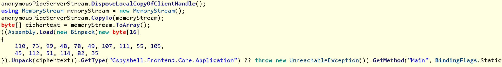
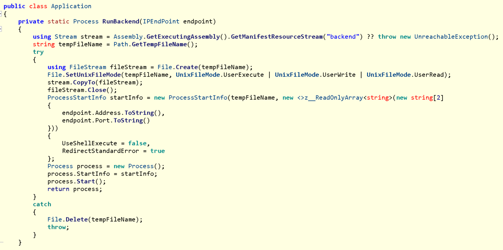
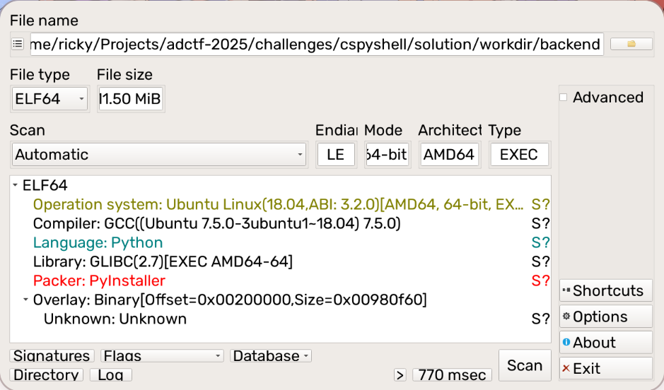
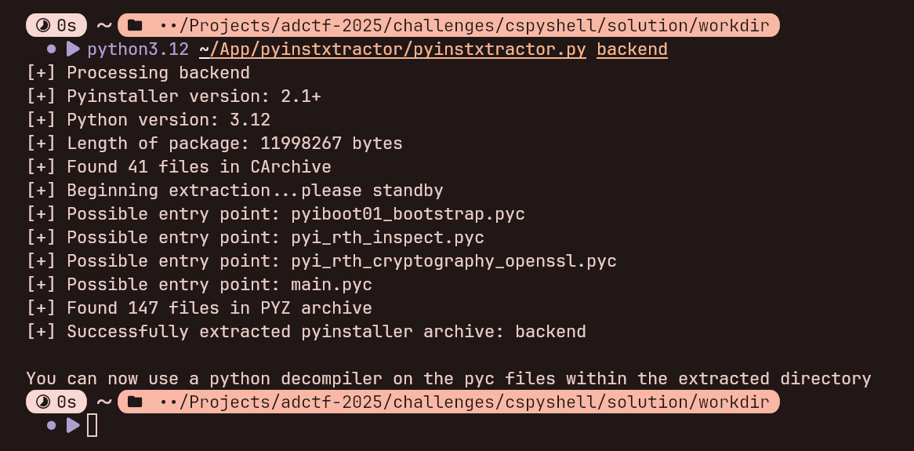
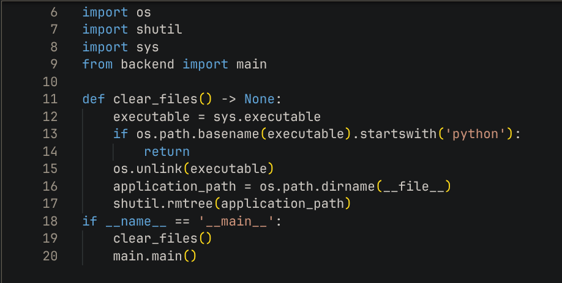

# cspyshell

## 题目描述

rk 打算弄一款能执行不同语言的 shell，并且采用了 C# 编写了控制台前端。

~~但是受限于时间，~~目前后端部分 rk 只做了 Python 支持，并且把这个半成品命名为 cs(C#)py(Python)shell~~，并发送给 Phrinky 展示成果~~。

Phrinky 对这个解释器进行了逆向工程分析，发现了存在信息泄漏风险，并且对其之间的通讯过程进行了抓包。

你能找到 Phrinky 所发现的设计缺陷，看到流量包中隐藏的信息吗？>w<

## 解题思路

根据题目信息可以确认这个为 .NET 编译产物，可以使用 ILSpy 进行反编译。

使用 ILSpy 反编译 Main 函数:


可以看到这边先使用了 Python 对可执行文件本身进行了执行。

Python 有个特性，它可以直接将数个 Python 文件打包成一个 Zip 文件，作为一个模块加载，而这里可以猜测就使用了这个特性。

可以看到 `binwalk` 结果确实有 Zip 档案包存在:


使用 `unzip` 解压 Zip 档案包:


看到 `__main__.py` 文件:


结合前面 .NET 部分传入 Python 的参数，可以看到这边把 Zip 档案包里的 `core.dll` 文件通过 Anonymous Pipe (匿名管道) 传输到了 .NET 应用那边。

再看回 .NET 对数据的处理:



数据通过 `Binpack.Unpack` 后通过 `Assmebly.Load` 加载 Assmebly 到了内存，并执行了 `Cspyshell.Frontend.Core.Application.Main` 函数。

这边可以直接把 `Binpack` 反编译结果直接复制出来，然后写个 C# 程序即可获得 Unpack 后的结果:


> 这边 Binpack 传入的 Key 是 `nIc0N1ko7i-p3rR#`，~~跟我一起来 にこにこに〜~~

或者直接自己写个 `Binpack` 实现来解包，这边将不做赘述。

解包之后的 `core.dll` 是可以直接在 ILSpy 正常反编译的:


看到 `Main` 函数中调用的 `RunBackend`:



可以看到 `backend` 文件存储在 .NET Assembly Resources 里面，`RunBackend` 函数会将其释放到临时文件夹里，并且将 Endpoint 作为参数传入。

随后就是 Frontend 和 Backend 之间的通讯过程分析了。

为了分析及处理方便，这边将直接提取出 `backend` 对 Python 部分进行解包分析:


使用 Detect It Easy 可以检测出是 PyInstaller 打包的程序:



使用 PyInstxtractor 解包 (注意需要使用 Python 3.12 (该程序使用 Python 3.12 打包，可通过 PyInstxtractor 输出判断)):



由于现有的很多 Python 反编译工具都不太支持高版本 Python，这边建议使用在线的反编译工具 https://www.pylingual.io/。

看到 `main.pyc`:



可以分析出来这边在可执行程序不为 `python` 开头时删除可执行文件目录下的所有文件 (为了防止你们直接翻临时文件夹 (x))，随后执行 `backend.main` 模块下的 `main` 函数。

`backend` 库可以通过 PyInstxtractor 解压出目录下的 `PYZ.pyz_extracted` 获得:


此处可以对 `backend.main` 模块进行反编译:


可以看出来这边通过 `generate_static_private_key` 函数生成了一个静态的 Private Key (其实这个就是题目描述提到的 *Phrinky 所发现的设计缺陷*)。

随后对 socket 进行了多层包装，并使用了前面生成的静态 Private Key 用于通信加密。

由于这边的第一层 wrapper 是 `SecureLayer`，我们可以对 `backend.protocols.secure` 模块进行反编译，看到 `SecureLayer.initiate_connection` 的定义，确认一下能否直接自定义一个 Socket 直接实现解包:


可以看出来这边接受一个 `UnsizedProtocolLayer` 和一个 `X25519PrivateKey`，最后通过 X25519 的 Key Exchange 生成了一个 Shared Key 再通过 HKDF + SHA512 生成了一个 Key 用于 AES-GCM 加密。

对 `backend.protocols.typing` 模块进行反编译，看到 `UnsizedProtocolLayer` 定义:


能确认可以通过自定义 Socket 实现解包。由于题目附件给出了流量包，可以提取出所有数据。此处只需要所有流量数据放到一个 buffer 里，实现 `recv` 函数去从 Buffer 中读取消耗并返回相应数据，`sendall` 直接声明为空函数即可。

使用 Tshark 解包出所有的流量数据包:

```shell
tshark -r capture.pcapng -Y "tcp.
payload" -T fields -e tcp.payload > payloads.txt
```

可以编写出以下脚本进行处理:

```python
import struct
import zlib
from collections.abc import Buffer
from io import BytesIO
from itertools import count
from random import Random
from typing import Any

from cryptography.hazmat.primitives.asymmetric.x25519 import X25519PrivateKey

from protocols.compression import CompressionLayer
from protocols.message import MessageLayer
from protocols.secure import SecureLayer


def generate_static_private_key(seed: Any) -> X25519PrivateKey:
    key_bytes = Random(seed).randbytes(32)
    key = X25519PrivateKey.from_private_bytes(key_bytes)
    return key


PRIVATE_KEY_SEED = bytes([13, 0, 7, 33, 1, 191, 82, 29, 75, 66, 17, 69, 20, 87, 167, 0])
PRIVATE_KEY = generate_static_private_key(PRIVATE_KEY_SEED)


class BufferLayer:
    _buffer: BytesIO

    def __init__(self, buffer: Buffer) -> None:
        self._buffer = BytesIO(buffer)

    def sendall(self, data: Buffer) -> None:
        return

    def recv(self, bufsize: int) -> bytes:
        return self._buffer.read(bufsize)


def main() -> None:
    buffer = bytearray()

    public_key_bytes = PRIVATE_KEY.public_key().public_bytes_raw()

    with open("payloads.txt", "r", encoding="ascii") as fp:
        for i in count():
            line = fp.readline()

            if not line:
                break

            data = bytes.fromhex(line)

            if i < 2 and data == public_key_bytes:  # skip public key send from my side
                continue

            buffer.extend(data)

    buffer_layer = BufferLayer(buffer)
    secure_layer = SecureLayer.initiate_connection(buffer_layer, PRIVATE_KEY)
    message_layer = MessageLayer(secure_layer)
    compression_layer = CompressionLayer(message_layer, zlib)

    while True:
        try:
            print(compression_layer.recv().decode())
        except struct.error:  # eof
            break


if __name__ == "__main__":
    main()
```

将 `protocols` 模块文件夹复制出来，与以上脚本保存到一个目录，使用 Python 3.12 (GNU/Linux) 安装依赖库 `cryptography` 并执行，可以提取出来以下内容:


可以发现这边自定义了一个加密函数，并执行了相应的加密操作输出了加密后的 Flag 值，可以编写出对应的解密脚本:

```python
import hashlib


def init_block(key: bytes) -> tuple[int, ...]:
    block = list(range(256))
    targets = hashlib.sha512(key).digest()
    new_targets = bytearray()

    for start in range(0, 256, 64):
        for i, byte in enumerate(targets):
            source, target = i + start, byte
            block[source], block[target] = block[target], block[source]

            new_targets.append(block[source] ^ byte)

        targets = bytes(new_targets)
        new_targets.clear()

    return block


def decrypt(plaintext: bytes, block: tuple[int, ...]) -> bytes:
    result = bytearray()

    for i, ch in enumerate(plaintext):
        idx = i & 0xFF
        byte = block[idx]

        result.append(ch ^ byte)
        block[idx], block[ch] = block[ch], block[idx]

    return bytes(result)


def main() -> None:
    ciphertext = bytes.fromhex(
        "b54789999e6bee080221624ada5044d76c4aef72ca58e01f4ab4a38aa7fbac0c691a50d7a45069bac3e3ecac4f7102a8a8e62f35f12d"
    )
    block = init_block(b"f0lloW p-mArU t7aNks m3ow.")
    plaintext = decrypt(ciphertext, block)
    print(plaintext.decode())


if __name__ == "__main__":
    main()
```

> ~~关注 *P丸様。*　谢谢喵！~~

执行后得到 Flag:


Flag 为: `flag{w0ndOrfUl_y0U_k@n_c5#rp_A_pYt7On_w1tHoUt_g1aS5es}`。
