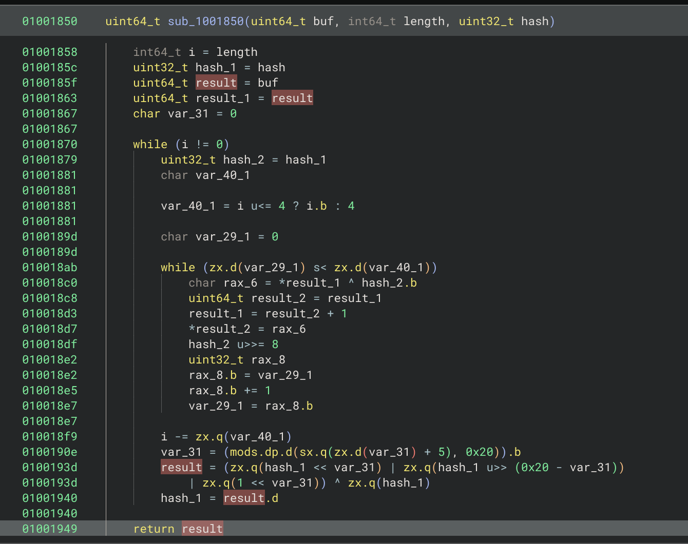
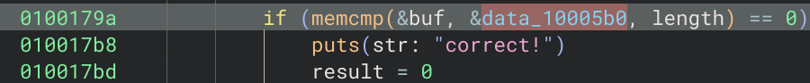
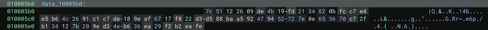
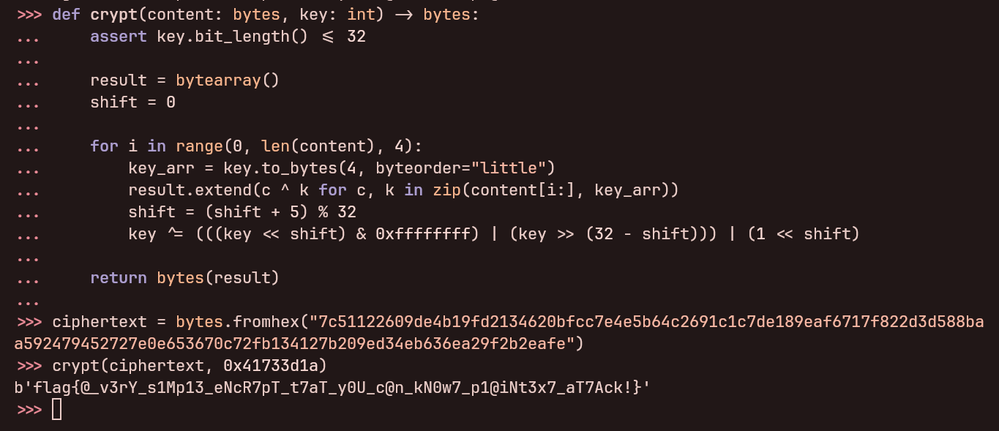

# ezenc

## 题目描述

rk 写了个简单的加密算法，但是这个加密算法安全吗？

> 提供的两个文件均由同一套代码编译而来，带 `.exe` 后缀的为 Windows x86-64 平台可执行文件，无后缀的为 Linux x86-64 (GNU) 平台可执行文件。

## 引入

这边提供了两个附件只是为了照顾还没配置好 Linux 环境的解题者而编译的。

后面我也给了提示说 **Linux 的反编译起来会更简单**，所以也建议大家以后看到同时有 Linux 可执行文件提供的**优先选择 Linux 的进行逆向工程**。

## 解题思路

为了方便分析，这边也将使用 Linux 产物进行分析。


使用反编译器查看可以大概分析出来: 读入的用户输入会在 `\r` 或 `\n` 的索引作为字符串的长度 (去除换行符)，且字符串长度应为 `0x40`。

随后字符串通过 `sub_10017f0` 函数计算值，并作为参数与字符串本身传入到 `sub_1001850` 函数进一步处理。

根据前面的分析对 `sub_10017f0` 的参数及变量进行重命名分析:


不难分析出来这是一个 Hash 函数。

再根据前面的分析对 `sub_1001850` 的参数及变量进行重命名分析。

由于根据前面的 `main` 函数分析可知此处函数应该是无返回值的。但反编译器认为它有返回值，且分析出了奇怪的结果 `result`:



于是我们可以将返回类型手动指定为 `void`，这样就能解决函数的分析问题:


可以发现函数中奇怪的 `result` 已经不见了，前面反编译器分析出来奇怪的过程也没了。

再对函数进行进一步分析，并对变量进行重命名:


可以得到加密过程为: 将 `buf` 拆分为 4B 大小的 Blocks，然后让 Block 和 `hash` 进行异或加密处理 (但要注意这边 `buf` 拆分出来的 Block 是对 `hash` 的高位对低位，低位对高位进行的反向异或)。随后以初始值为 0 的 `shift`，经过运算 `(shift + 5) % 20` 得到的新 `shift`，将 `hash` 进行运算 `hash << shift | hash >> (0x20 - shift) | 1 << shift` 得到了新 `hash` 再进行下一轮的异或加密。

基于异或运算可逆原理，不难发现，这边只需要知道了明文的前 4 bytes，就可以爆破出相应的 Hash，而且这边加解密过程是一致的。而我们知道明文 (Flag) 的前四位通常是 `flag`，我们可以通过 `main` 函数找到密文进行验证:





提取得到 Hex:

```plaintext
7c51122609de4b19fd2134620bfcc7e4e5b64c2691c1c7de189eaf6717f822d3d588baa592479452727e0e653670c72fb134127b209ed34eb636ea29f2b2eafe
```

注意上面分析过 Block 是对 `hash` 进行的反向异或，所以我们这边需要对密文与 `flag` 字符串进行反向异或处理，可编写出 Python 代码进行运算:

```python
head_cipher = bytes.fromhex("7c511226")
head_plain = b"flag"
print(hex(int.from_bytes(head_cipher, "little") ^ int.from_bytes(head_plain, "little")))
# 0x41733d1a
```


可得到 `hash` 为: `0x41733d1a`。

再根据上面分析出来的加密流程使用 Python 编写加解密函数:

```python
def crypt(content: bytes, key: int) -> bytes:
    assert key.bit_length() <= 32

    result = bytearray()
    shift = 0

    for i in range(0, len(content), 4):
        key_arr = key.to_bytes(4, byteorder="little")
        result.extend(c ^ k for c, k in zip(content[i:], key_arr))
        shift = (shift + 5) % 32
        key ^= (((key << shift) & 0xffffffff) | (key >> (32 - shift))) | (1 << shift)

    return bytes(result)
```

使用上面得到的 `hash` 和 `ciphertext` 传入函数即可得到 Flag:



Flag 为: `flag{@_v3rY_s1Mp13_eNcR7pT_t7aT_y0U_c@n_kN0w7_p1@iNt3x7_aT7Ack!}`
