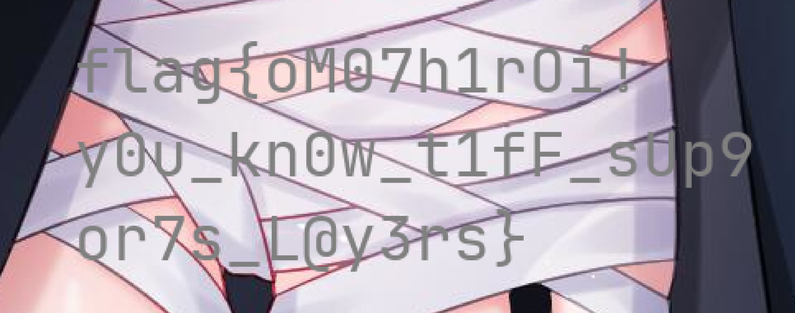

# フラッグモザイク (Flag Mosaic)

## 题目描述

> 命名由来：きんいろモザイク（没看过这个番，~~只知道黄金马赛克这个名字梗（x~~）

有涩图看了😋，怎么有可恶的春赛克😡！

现在 AI 这么发达，应该能够找它帮忙去除可恶的春赛克吧！嗯！

## 引入

想着比赛这次没出传统的 Misc 题，随便出个图片隐写题玩玩的。但是想到一般的图片隐写都过于套路化，于是找到了 TIFF 这种支持多图层的图片格式出个简单好玩的隐写题来给大家玩玩 (至于为什么不用 PSD 之类的理由显而易见了，一看就能猜到的不大好玩 (x))。

## 解题思路

可以通过 Krita 一类图片编辑软件打开图片:

可以看到有 4 个图层，其中部分软件只支持显示背景图图层，所以背景图层只是前面几个图层的 Merge 结果。

把春赛克图层去除掉就能看到 Flag:

Flag 为: `flag{oM07h1rOi!y0u_kn0w_t1fF_sUp9or7s_L@y3rs}`

> Ema 可爱捏😋

## 后记

有部分选手拿着可能某些软件自带的 OCR 结果问我为什么不对 xwx (我看到的结果都是 `0` 和 `O` 混淆了，但实际上肉眼看是很明显看得出来有区别的)。

可能大家不知道 TIFF 只是支持多**图**层，图层保存的也只是图片格式，所以以为软件复制出来的就是原始数据 (x)。

我是真没想到 macOS 自带的图片查看器还支持 TIFF 的多图层，感觉被资本做局了 QwQ。
