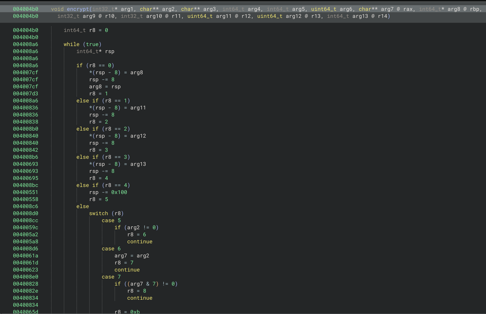
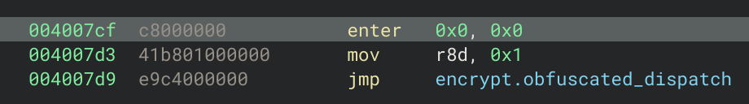
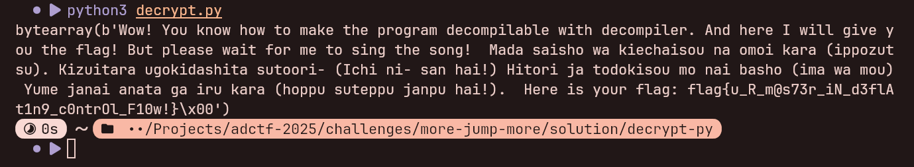
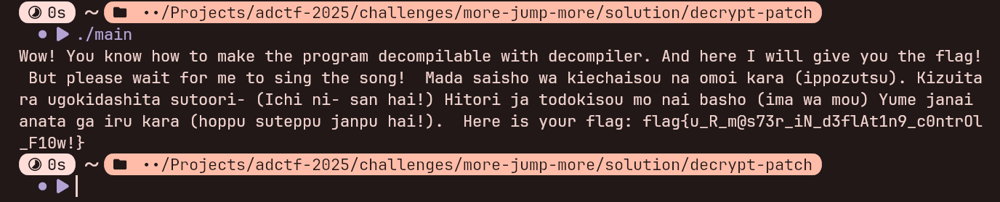

# モア！ジャンプ！モア！(More! Jump! More!)

## 题目描述

> [打卡啦摩托！](https://www.bilibili.com/video/BV1vH4y1z7UW)
> 
> 本题目与视频及歌曲本身无关，仅借名字出题（

## 解题思路

使用反编译器打开二进制文件:


可以看出来 `main` 函数十分简单: 用户输入和一个定义的 Key 通过 `encrypt` 函数得到加密结果和 `ciphertext` 做对比。

但是看到 `encrypt` 函数:



会发现函数体的反编译结果非常复杂，不难猜测出来函数控制流被平坦化了。

但是看到反编译代码:


会发现这边的平坦化处理非常地有规律。

再看到 `encrypt.obfuscated_0`:



可以发现 `encrypt.obfuscated_0` 下一个执行的 Block 的 `r8` Branch 值是 `encrypt.obfuscated_1`，再看多几个 Branch 不难判断出来如果是顺序执行的 Branch，那么它的 `r8` 是单调 `+1` 递增的。

再看到 `encrypt.obfuscated_55`:


可以发现 `jnz` 一类带有条件判断跳转的是直接跳转到相应的标签。

结合以上发现，可以利用以下想法写出脚本:

1. 先把 `encrypt.obfuscated_` 后面的 Branch 值按照顺序拼接起来；
2. 如果 Branch 相应执行后的 `r8` 是相对本 Branch 的值是 `+1` 的视为顺序执行，无需另外处理，否则保留相应分支的 Label 并跳转到相应分支；
3. 如果 Branch 相应执行后为 `jne` 一类有条件判断跳转的保留相应分支的 Label 并保留相应指令跳转到相应分支；
4. 删除多余的分支 (删去可方便后续的分析)。

直接利用 `angr` 库编写脚本恢复控制流，输出相应汇编代码:

```python
from typing import Generator, cast

import angr


def iter_blocks(start: int, end: int) -> Generator[angr.Block, None, None]:
    while start < end:
        block = project.factory.block(start)
        yield block

        assert isinstance(block.size, int)
        start += block.size


function_start = 0x004004B8  # skip the first xor and jmp instruction
dispatch_start = 0x004008A2
dispatch_end = 0x00400B42
dispatch_register = "r8"

recovered_label_prefix = ".snippet_"
spaces = " " * 4
start_label_name = "encrypt"

project = angr.Project("./more-jump-more")

dispatch_values: dict[int, int] = {}

for block in iter_blocks(dispatch_start, dispatch_end):
    cmp, je = cast(list[angr.block.DisassemblerInsn], block.disassembly.insns)
    assert cmp.mnemonic == "cmp" and je.mnemonic == "je"

    register, _, value = cmp.op_str.partition(", ")
    assert register == dispatch_register

    value = int(value.strip(), 16)
    target = int(je.op_str, 16)

    dispatch_values[target] = value


snippets: dict[int, list[str]] = {0: []}
cur_snippet: int = 0

ref_snippets = set[int]()

for block in iter_blocks(function_start, dispatch_start):
    insns: list[angr.block.DisassemblerInsn] = block.disassembly.insns
    insn_iter = iter(insns)

    for insn in insn_iter:
        if (value := dispatch_values.get(insn.address)) is not None:
            cur_snippet = value
            snippets[cur_snippet] = []

        if insn.mnemonic == "mov":
            register, _, value = insn.op_str.partition(", ")
            if register.startswith("r8"):
                mov = insn
                jmp = next(insn_iter)
                assert jmp.mnemonic == "jmp"

                value = int(value, 16)

                if value not in dispatch_values.values():  # probably end reached
                    continue

                if value != cur_snippet + 1:  # not fallthrough
                    ref_snippets.add(value)
                    snippets[cur_snippet].append(f"jmp {recovered_label_prefix}{value}")

                continue

        if insn.mnemonic.startswith("j"):  # jump-related
            target = int(insn.op_str, 16)
            value = dispatch_values[target]

            ref_snippets.add(value)

            snippets[cur_snippet].append(f"{insn.mnemonic} {recovered_label_prefix}{value}")
            continue

        op_str = insn.op_str.replace("ptr ", "")  # make it nasm-compatible
        snippets[cur_snippet].append(f"{insn.mnemonic} {op_str}")


print("section .text")
print(f"{start_label_name}:")

for value, snippet in sorted(snippets.items(), key=lambda item: item[0]):
    if value in ref_snippets:
        print(f"{recovered_label_prefix}{value}:")

    for line in snippet:
        print(f"{spaces}{line}")
```

处理后输出的代码为:

```nasm
section .text
encrypt:
    enter 0, 0
    push r12
    push r13
    push r14
    sub rsp, 0x100
    test rsi, rsi
    je .snippet_61
    mov rax, rsi
    test rax, 7
    je .snippet_10
    mov eax, 1
    jmp .snippet_62
.snippet_10:
    xor rax, rax
.snippet_12:
    mov byte [rsp + rax], al
    add al, 1
    jae .snippet_12
.snippet_14:
    test rcx, rcx
    je .snippet_27
    xor rax, rax
    xor r14, r14
    xor r9, r9
.snippet_19:
    add r14b, byte [rdx + rax]
    mov r10b, byte [rsp + r14]
    xchg byte [rsp + r9], r10b
    mov byte [rsp + r14], r10b
    add r9b, 1
    jae .snippet_19
    inc rax
    cmp rax, rcx
    jl .snippet_19
.snippet_27:
    xor r14, r14
.snippet_28:
    mov al, 0x20
    mov r9d, 0x9e3779b9
    mov r10d, dword [rdi]
    mov r11d, dword [rdi + 4]
.snippet_32:
    mov r12d, r11d
    shl r12d, 4
    add r12d, dword [rsp + r14]
    mov r13d, r11d
    add r13d, r9d
    xor r12d, r13d
    mov r13d, r11d
    shr r13d, 5
    add r13d, dword [rsp + r14 + 4]
    xor r12d, r13d
    add r10d, r12d
    mov r12d, r10d
    shl r12d, 4
    add r12d, dword [rsp + r14 + 8]
    mov r13d, r10d
    add r13d, r9d
    xor r12d, r13d
    mov r13d, r10d
    shr r13d, 5
    add r13d, dword [rsp + r14 + 0xc]
    xor r12d, r13d
    add r11d, r12d
    add r9d, 0x9e3779b9
    sub al, 1
    jne .snippet_32
    mov dword [rdi], r10d
    mov dword [rdi + 4], r11d
    add rdi, 8
    sub rsi, 8
    je .snippet_61
    add r14b, 0x10
    jb .snippet_14
    jmp .snippet_28
.snippet_61:
    mov eax, 0
.snippet_62:
    add rsp, 0x100
    pop r14
    pop r13
    pop r12
    leave 
    ret 
```

将其保存为文件 `encrypt.asm`，随后使用 `nasm` 编译器编译成 ELF 分析 (注意一下必须是 `ELF`，每个操作系统选用的 Calling Convension 都不一样，选择不对会存在分析和执行问题):

```shell
nasm -o encrypt.o -f elf64 encrypt.asm
```

可以看到 `encrypt` 函数被成功恢复:


根据 `main` 函数的调用参数传入，并进一步分析可以重命名变量以便分析:


不难发现开头先初始化了一个 `0xff` 的 Box，Box 的值为其索引。

然后利用了 Key 对 Box 的元素进行了交换:


然后经过了 TEA 加密 (可以通过 `0x9e3779b9` 和 `<< 4`, `>> 5` 特征判断):


在 TEA 加密时，`bufsize` 为 `0` 时则直接返回，而如果计数器达到了 `0xf0` (Box 最后一个值已经被使用了)，则退出循环，重新回到最外层 `while (true)` 循环再次进行密钥轮换后加密，如此往复。

不难得出来，只要把这边的 TEA 加密函数替换成解密函数即可解出数据。

先从 `more-jump-more` 可执行文件中提取出相应的 Ciphertext 和 Key。

```
hex(ciphertext) = "1f6823d665bebf670ccfd0eaf14e692e4d657b19a7f16d0774601da7e496dcdf6db935e3bc238e54f621708dea6606226f9440dbefc8a6f0f79bc34771abba4eb30013a1dd09810ebbcafab88c8b52c56caab3a8ce1ba4de1bfbb236409b8ac474bad50737e52bcc1c8efa098827b6a424973f367015b3dfdf262236abe2c7eb658f0163824ad4bd4c8085f6bc6544fc9e737e682a72c6de3cda1bd4bdfe78c427b03ad0a552bdf8a13ec5de9946a191d78d30a51091fb66aef3525e6a851346359129809d5336ad03f1c25e038b086ce9f628c92516aca51d8fe5d9be35bde6de6ff021e51309ea7db76804b7cd1f173df7640815d5e716122c9b079612e929d98f3f98252fdbb93195da9711f98f53b838275efb26c67042cb8f67e508294e90559687e767ebc74c5184f56c4d35f969583a1012b0cf6770677ceb2da98a0a00ccae243f935f0f7d2926761153592d37a97d4df6d9531b15507b92e800793dbd5aba0f21056cab76bc5ead0fca41a8dbce67f8d3a26043e74cea6bf377cb4d28f1665538e984a061cb33465ff4ac24306b932583c93f41f207981b638fd496"
hex(key) = "44616b6172614d6f74746f214368696b617a756b697461694b6172614d6f74746f214b6f654b696b61736574657e536f6e6f54655473756b616e646172612c48616e6173616e61694b6172617e49737365656e6f6f64654d6f74746f4d6f74746f4a756d704869676821"
```

此处将介绍两种方法进行解题。

第一种是直接编写脚本，对于不太熟悉 x86 汇编的人来说可能这样比较好懂一点。

可根据前面的分析结果编写出脚本 (需按照提示填充相应数据):

```python
import ctypes
import struct


def next_block(block: list[int], key: bytes) -> None:
    target = 0

    for k in key:
        for source in range(256):
            target = (target + k) & 0xFF

            block[source], block[target] = block[target], block[source]


def init_block() -> list[int]:
    return list(range(256))


def tea_decrypt(v: tuple[int, int], k: tuple[int, int, int, int]) -> tuple[int, int]:
    v0 = ctypes.c_uint32(v[0])
    v1 = ctypes.c_uint32(v[1])
    sum = ctypes.c_uint32(0xC6EF3720)

    for _ in range(32):
        v1.value -= ((v0.value << 4) + k[2]) ^ (v0.value + sum.value) ^ ((v0.value >> 5) + k[3])
        v0.value -= ((v1.value << 4) + k[0]) ^ (v1.value + sum.value) ^ ((v1.value >> 5) + k[1])
        sum.value -= 0x9E3779B9

    return (v0.value, v1.value)


def decrypt(plaintext: bytes, key: bytes) -> bytes:
    if len(plaintext) % 8 != 0:
        raise ValueError

    raw_block = init_block()
    block: list[int] = []

    ciphertext = bytearray()

    for i in range(0, len(plaintext), 8):
        block = block[16:]
        if not block:
            next_block(raw_block, key)
            block = raw_block

        v = struct.unpack("<II", plaintext[i : i + 8])
        k = struct.unpack("<IIII", bytes(block[:16]))

        result = tea_decrypt(v, k)
        ciphertext.extend(b for num in result for b in num.to_bytes(4, "little"))

    return ciphertext


def format_bytes(b: bytes) -> str:
    return ", ".join(f"0x{byte:02x}" for byte in b)


def main() -> None:
    # fmt: off
    ciphertext = bytes.fromhex("...")  # fill '...' with ciphertext hex
    key = bytes.fromhex("...")  # fill '...' with key hex
    # fmt: on

    print(decrypt(ciphertext, key))


if __name__ == "__main__":
    main()
```

运行后可得到 Flag:



第二种方法就是直接对输出的 Assembly 进行 Patch 了，鉴于篇幅长度考虑，这边给出相应的 Patch 文件:

```patch
--- encrypt.asm	2025-10-30 13:20:00.907829959 +0800
+++ decrypt.asm	2025-10-30 13:50:15.522347765 +0800
@@ -1,5 +1,6 @@
+global decrypt
 section .text
-encrypt:
+decrypt:
     enter 0, 0
     push r12
     push r13
@@ -38,21 +39,10 @@
     xor r14, r14
 .snippet_28:
     mov al, 0x20
-    mov r9d, 0x9e3779b9
+    mov r9d, 0xc6ef3720
     mov r10d, dword [rdi]
     mov r11d, dword [rdi + 4]
 .snippet_32:
-    mov r12d, r11d
-    shl r12d, 4
-    add r12d, dword [rsp + r14]
-    mov r13d, r11d
-    add r13d, r9d
-    xor r12d, r13d
-    mov r13d, r11d
-    shr r13d, 5
-    add r13d, dword [rsp + r14 + 4]
-    xor r12d, r13d
-    add r10d, r12d
     mov r12d, r10d
     shl r12d, 4
     add r12d, dword [rsp + r14 + 8]
@@ -63,8 +53,19 @@
     shr r13d, 5
     add r13d, dword [rsp + r14 + 0xc]
     xor r12d, r13d
-    add r11d, r12d
-    add r9d, 0x9e3779b9
+    sub r11d, r12d
+    mov r12d, r11d
+    shl r12d, 4
+    add r12d, dword [rsp + r14]
+    mov r13d, r11d
+    add r13d, r9d
+    xor r12d, r13d
+    mov r13d, r11d
+    shr r13d, 5
+    add r13d, dword [rsp + r14 + 4]
+    xor r12d, r13d
+    sub r10d, r12d
+    sub r9d, 0x9e3779b9
     sub al, 1
     jne .snippet_32
     mov dword [rdi], r10d
```

将 Patch 内容保存到 `decrypt.patch`，并通过以下命令输出结果到 `decrypt.asm`:

```shell
patch -u -o decrypt.asm encrypt.asm -i decrypt.patch
```

将 `decrypt.o` 编译成 ELF:

```shell
nasm -o decrypt.o -f elf64 decrypt.asm
```

随后使用 C 编写出相应的 `main.c` (需按照提示填充相应数据):

```c
#include <stdint.h>
#include <stdio.h>
#include <string.h>

#include "decrypt.h"

static char text[] = {...};  // fill '...' with ciphertext bytes
static const char key[] = {...};  // fill '...' with key bytes

int main() {
    uint64_t retval;

    retval = decrypt(text, sizeof(text), key, sizeof(key));
    if (retval != 0) return retval;

    puts(text);
}
```

补充上头文件 `decrypt.h`:

```c
#include <stddef.h>

extern uint64_t encrypt(void* buf, size_t bufsize, const void* key,
                        size_t keysize);
```

使用以下指令编译成可执行文件:

```shell
gcc -Wall -Werror -o main decrypt.o main.c
```

运行 `main` 二进制文件即可得到 Flag:



Flag 为: `flag{u_R_m@s73r_iN_d3flAt1n9_c0ntrOl_F10w!}`。

## 后记

这个 `encrypt` 函数是我直接用 `nasm` 编写的，然后自己用 Python 手搓了个混淆器来实现控制流平坦化的，具体实现可以看源代码。
