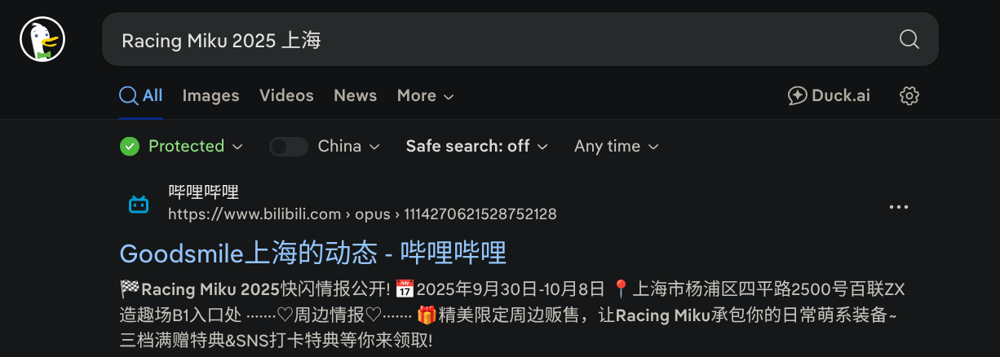
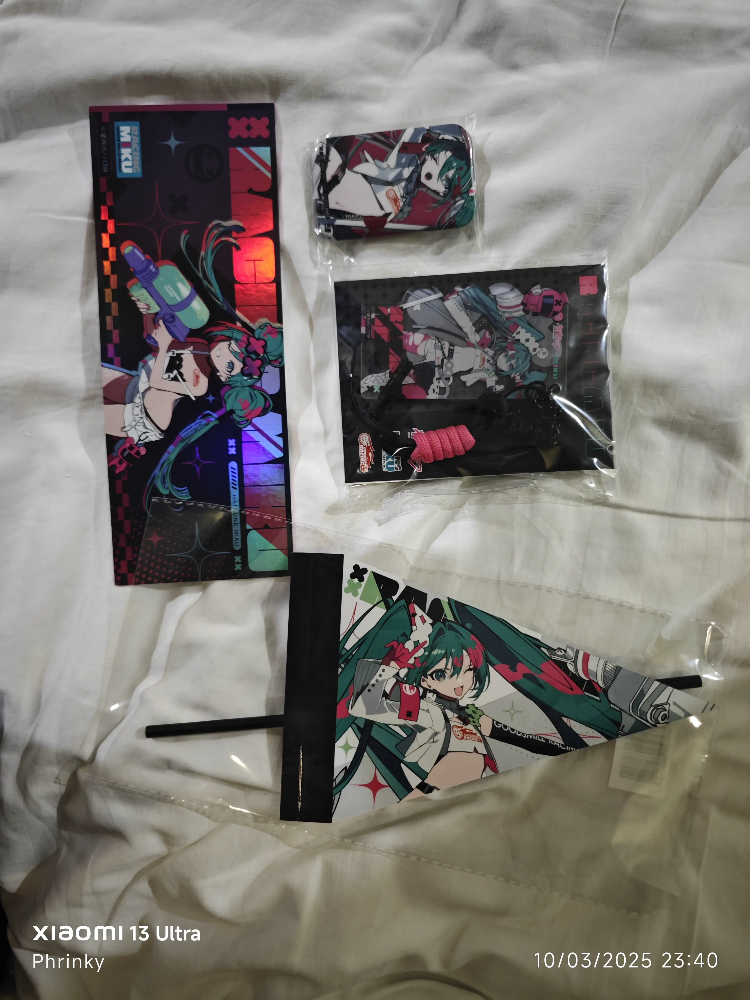
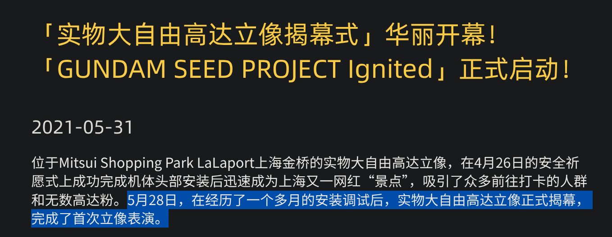
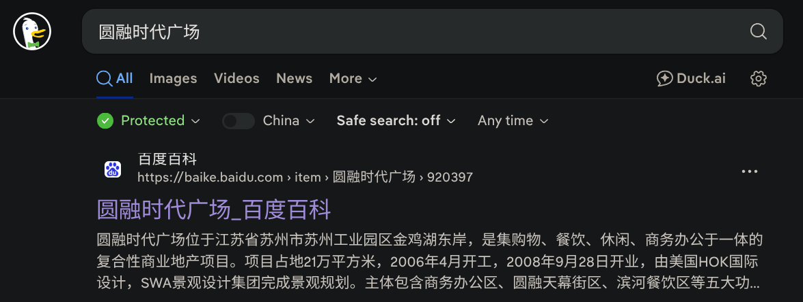
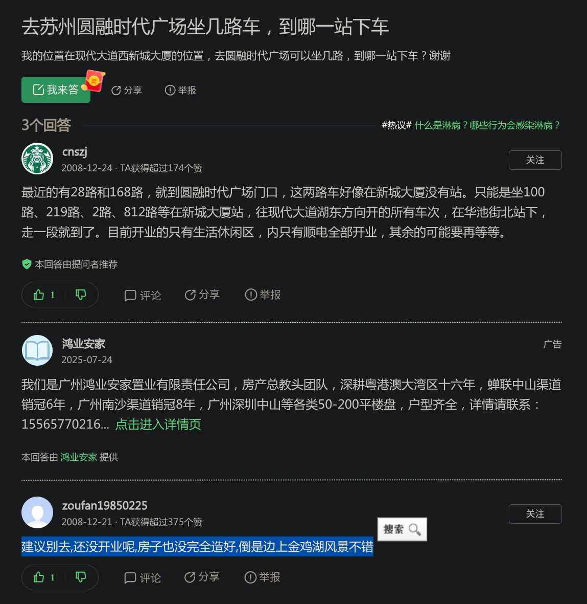
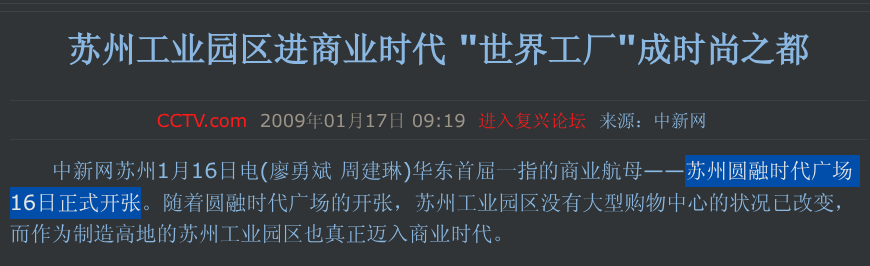

# Neko Q&A

## 题目描述

**猫猫问答（GDUTCTF-2025 / ADCTF-2025 版）**

rk 国庆出去玩了，来盒一下 rk 去了哪吧～

## 引入

我是真没有想到大家还能在资源加载失败的情况下，还能硬着头皮在没有图片和错误提示的情况下继续做题 (给各位跪下了 Orz)。

## 解题思路

### 第一题

> 十一假期到了，rk 和 LSJGP 来到了沪国（aka. 上海）玩。下图是 rk 在旅程第二天拍的一张照片，你知道这是在举行什么活动吗？请写出 **活动形象代表人物的英文名称、本届活动的起始和终止日期**（名称和日期之间使用 **斜杠 `/` 进行分隔**，起始和终止时间使用 **短横线 `-` 进行连接**，日期格式为 `YYYYmmdd`，格式示例: `Izumi Konata/20070408-20070917`）
> 
> 

通过放大图片查看细节可以看到以下元素:

根据 `Racing Miku` 和 `Good Smile` 两个关键词可以检索到 *[Good Smile Racing](https://vocaloid.fandom.com/wiki/Good_Smile_Racing)* 这个活动:

可以确认角色是 *Hatsune Miku* 的派生 (derivative) 形象 *Racing Miku*:

> 很多人都看到 Hatsune Miku 就直接认为这个角色就是 *Hatsune Miku*，但实际上她是 *Hatsune Miku* 派生而来的角色 *Racing Miku*，个人认为这个 **活动形象代表人物** 应该为 *Racing Miku* 比较准确。

通过检索关键词 `Racing Miku 2025 上海` 可以确定时间:

根据格式要求可确认答案为: `Racing Miku/20250930-20251008`。

> 战利品展示:
> 
> 

### 第二题

> 在旅程的第三天，在 rk 不知情之下，LSJGP 把 rk ~~拐到了~~一个陌生的地方去看立像。你知道 rk ~~被拐到~~哪里去了吗？请写出 **该立像的揭幕日期、所处购物中心的运营企业名称**（日期格式为 `YYYYmmdd`，日期和名称之间使用 **斜杠 `/` 进行分隔**，企业如果为境外企业请使用 **所属地语言文字** 表示，格式示例: `20110815/株式会社京都アニメーション`）
> 
> 

直接使用 Google Lens 或者一类识图工具可以确定是上海浦东新区的实物大自由高达:

通过搜索关键词 `上海 大自由高达 揭幕` 可以找到 Bandai Namco 的 [报导](https://www.bandainamcochina.cn/zh-cn/news/%E3%80%8C%E5%AE%9E%E7%89%A9%E5%A4%A7%E8%87%AA%E7%94%B1%E9%AB%98%E8%BE%BE%E7%AB%8B%E5%83%8F%E6%8F%AD%E5%B9%95%E5%BC%8F%E3%80%8D%E5%8D%8E%E4%B8%BD%E5%BC%80%E5%B9%95%EF%BC%81-%E3%80%8Cgundam-seed-project/):

可确认揭幕时间为 2021 年 5 月 28 日。

同时可以通过上面的报导可以确认所处购物中心名称为 *Mitsui Shopping Park LaLaport 上海金桥*。

通过在搜索引擎检索关键词 `LaLaport 上海金桥` 可以检索到 Wikipedia 的 [相关条目](https://zh.wikipedia.org/wiki/%E5%95%A6%E5%95%A6%E5%AE%9D%E9%83%BD%E4%B8%8A%E6%B5%B7%E9%87%91%E6%A1%A5):

可以确认运营企业为 *三井不动产*，点击到所链接的条目:

并看到官网名称:

可以确认运营企业名称使用所属地语言文字表示为 *三井不動産株式会社*。

根据格式要求可确认答案为: `20210528/三井不動産株式会社`。

### 第三题

> 转眼间，旅程已经来到了第四天，rk 和 LSJGP 乘坐动车来到了苏州，rk 在来到的第一天晚上到处乱逛。下面是 rk 不知道在哪拍的一张照片，看到非常好看就拍下来了。你知道 rk 拍照点 **所在商业场所的名称及其开业日期** 吗？（名称和日期之间使用 **斜杠 `/` 进行分隔**，日期格式为 `YYYYmmdd`，格式示例：`正佳广场/20050115`）\n\n
> 
> 

直接使用 Google Lens 或者一类识图工具可以确定是 *圆融时代广场*:

直接检索关键词 `圆融时代广场` 可以检索到百度百科的 [相关条目](https://baike.baidu.com/item/%E5%9C%86%E8%9E%8D%E6%97%B6%E4%BB%A3%E5%B9%BF%E5%9C%BA/920397):

可确认开业时间为 2008 年 9 月 28 日。

根据格式要求可确认答案为: `圆融时代广场/20080928`。

## 后记

感谢选手 *哈基米* 的报告:

经核实第三题的 *圆融时代广场* 的开业时间应该为 2009 年 1 月 16 日。

可看到一篇 2008-03-28 发布的 [新闻报导](https://news.fang.com/2008-03-28/1620015_all.htm) 中看到:

确实有 2008 年 9 月 28 日这个时间的存在。

但是看到在百度问答 2008-12-21 的一个 [回答](https://zhidao.baidu.com/question/79633306.html):

其中明确提到了 **还没开业**。

再看到 2009-01-19 的一篇 [新闻](http://www.ce.cn/xwzx/gnsz/gnleft/mttt/200901/19/t20090119_17999860_4.shtml):

可以进一步确认 2008 年 9 月 28 日并未开始营业，而到了 2008 年 12 月 16 日才开始试营业，也验证了前面搜索到的回答。

后文的 “2009 年 1 月，结合久光百货、圆融天幕街区等区的开业，圆融时代广场将盛装开幕。” 确认了圆融时代广场在 2009 年 1 月开业。

再看到 CCTV 在 2009-01-17 的 [报导](https://news.cctv.com/china/20090117/101357.shtml):

确认了圆融时代广场的开业时间应为 2009 年 1 月 16 日。
