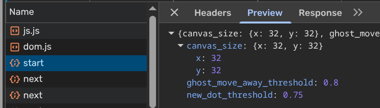
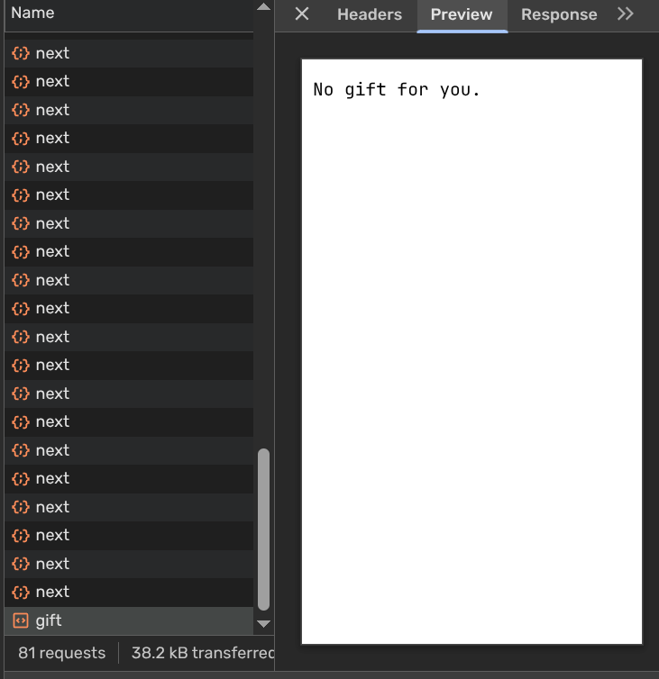
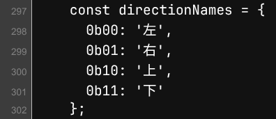
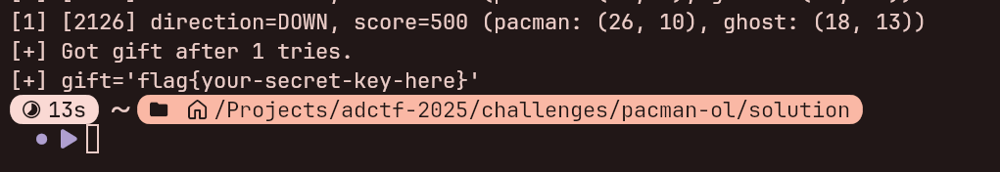

# PacmanOL

## 题目描述

```shell
pacman -S pacman-ol
```

🐧 ~~来使用 Arch Linux 吧（并非）~~

👻 来玩吃豆人（Pacman）吧！

🏆 拿到 500 分就有奖励哦～

## 引入

其实本来这道题是想要设计成 1000 分过的，但是考虑到选手编写脚本难度上的考虑，降低到了 500 分，但没想到我最终不小心写到代码里写成了 300 分 QwQ，很多人都直接玩通关了 xwx。

## 解题思路

先抓包分析:



可以看到游戏开始时调用了 `/start` API，然后返回了 Canvas Size 和其他游戏难度相关的参数。

随后调用 `/next` API，并传入了 `direction` (方向):


`/next` API 返回了豆、鬼、吃豆人的位置:


游戏结束后调用了 `/gift` API:



根据题目的提示可以知道只有达到 500 分 ~~(实际是 300 分)~~ 的时候才能拿到 Flag。

随后再看到源代码:




可以找到执行下一步操作的相应 API 路径以及 Direction 对应的 Enum 值。

可以写出相应的自动化脚本进行解题 (该脚本依赖 `httpx` 和 `pydantic` 库):

```python
from enum import IntEnum
from itertools import count
from typing import Callable, Generator

from httpx import Client
from pydantic import BaseModel, ConfigDict, Field


class Direction(IntEnum):
    LEFT = 0b00
    RIGHT = 0b01
    UP = 0b10
    DOWN = 0b11


class Distance2D(BaseModel):
    x: int
    y: int

    def as_tuple(self) -> tuple[int, int]:
        return (self.x, self.y)

    def __lt__(self, other: Distance2D) -> bool:
        return self.x < other.x and self.y < other.y

    def __le__(self, other: Distance2D) -> bool:
        return self.x <= other.x and self.y <= other.y

    def __gt__(self, other: Distance2D) -> bool:
        return self.x > other.x and self.y > other.y

    def __ge__(self, other: Distance2D) -> bool:
        return self.x >= other.x and self.y >= other.y

    def __hash__(self) -> int:
        return hash((self.x, self.y))

    def __sub__(self, other: Distance2D) -> Distance2D:
        return Distance2D(x=self.x - other.x, y=self.y - other.y)

    def __add__(self, other: Distance2D) -> Distance2D:
        return Distance2D(x=self.x + other.x, y=self.y + other.y)

    def __mul__(self, num: int) -> Distance2D:
        return Distance2D(x=self.x * num, y=self.y * num)

    def __floordiv__(self, num: int) -> Distance2D:
        return Distance2D(x=self.x // num, y=self.y // num)

    def __neg__(self) -> Distance2D:
        return Distance2D(x=-self.x, y=-self.y)

    def __pos__(self) -> Distance2D:
        return Distance2D(x=+self.x, y=+self.y)

    def __abs__(self) -> Distance2D:
        return Distance2D(x=abs(self.x), y=abs(self.y))

    def __str__(self) -> str:
        return f"({self.x}, {self.y})"

    model_config = ConfigDict(frozen=True)


class Axis2D(Distance2D):
    x: int = Field(ge=0)
    y: int = Field(ge=0)

    def move(self, direction: Direction, *, step: int = 1, corner: Size2D | None = None) -> Axis2D:
        step *= ((direction & 0b1) << 1) - 1

        x, y = self.as_tuple()

        if direction & 0b10:
            y = max(y + step, 0)
        else:
            x = max(x + step, 0)

        if corner:
            x = min(x, corner.x - 1)
            y = min(y, corner.y - 1)

        return Axis2D(x=x, y=y)

    def __hash__(self) -> int:
        return hash((self.x, self.y))


class Size2D(Axis2D):
    x: int = Field(gt=0)
    y: int = Field(gt=0)

    @property
    def axis_count(self) -> int:
        return self.x * self.y

    @property
    def end(self) -> Axis2D:
        return Axis2D.model_validate((self - Distance2D(x=1, y=1)).model_dump())

    def iter_axises(self) -> Generator[Axis2D, None, None]:
        return (Axis2D(x=x, y=y) for y in range(self.y) for x in range(self.x))

    def __contains__(self, axis: Axis2D) -> bool:
        return axis < self


class Context(BaseModel):
    pacman: Axis2D = Field(default_factory=lambda: Axis2D(x=0, y=0))
    direction: Direction = Direction.DOWN

    ghost: Axis2D

    dots: set[Axis2D] = Field(default_factory=set[Axis2D])

    score: int = 0
    alive: bool = True


class Settings(BaseModel):
    canvas_size: Size2D = Field(default_factory=lambda: Size2D(x=32, y=32))
    ghost_move_away_threshold: float = Field(ge=0, le=1, default=0.9)
    new_dot_threshold: float = Field(ge=0, le=1, default=0.8)


class Game:
    client: Client

    def __init__(self, base_url: str) -> None:
        self.client = Client(base_url=base_url)

    def next(self, direction: Direction | None = None) -> Context:
        resp = self.client.post("/next", json={"direction": direction})
        context = Context.model_validate_json(resp.content)
        return context

    def gift(self) -> str:
        resp = self.client.get("/gift")
        return resp.text

    def start(self) -> None:
        resp = self.client.post("/start")
        settings = Settings.model_validate_json(resp.content)
        return settings


cbd: Callable[[Distance2D], int] = lambda distance: sum(abs(distance).as_tuple())


def main() -> None:
    base_url = input("Game URL: ")

    for ntry in count(1):
        client = Game(base_url)
        settings = client.start()

        passed = False

        context = client.next()
        for i in count(1):
            passed = context.score >= 500

            if not context.alive or passed:
                break

            evaluation: list[tuple[int, Direction]] = []

            def evaluate(direction: Direction) -> int:
                new_pacman = context.pacman.move(direction)
                center = settings.canvas_size // 2

                ghost_distance = cbd(new_pacman - context.ghost)
                center_distance = cbd(new_pacman - center)

                nearest_dot = None
                if context.dots:
                    nearest_dot = min(context.dots, key=lambda dot: cbd(new_pacman - dot))
                dot_distance = cbd(new_pacman - (nearest_dot or center))

                score = -dot_distance * 2 + ghost_distance + -center_distance
                if ghost_distance <= 4:
                    score -= 100
                return score

            if context.pacman.x > 0:
                direction = Direction.LEFT
                score = evaluate(direction)
                evaluation.append((score, direction))

            if context.pacman.x < settings.canvas_size.end.x:
                direction = Direction.RIGHT
                score = evaluate(direction)
                evaluation.append((score, direction))

            if context.pacman.y > 0:
                direction = Direction.UP
                score = evaluate(direction)
                evaluation.append((score, direction))

            if context.pacman.y < settings.canvas_size.end.y:
                direction = Direction.DOWN
                score = evaluate(direction)
                evaluation.append((score, direction))

            evaluation.sort(key=lambda value: value[0], reverse=True)
            score, direction = evaluation[0]
            context = client.next(direction)

            print(f"[{ntry}] [{i}] direction={direction.name}, score={context.score} (pacman: {context.pacman}, ghost: {context.ghost})")

        if passed:
            print(f"[+] Got gift after {ntry} tries.")

            gift = client.gift()
            print(f"[+] {gift=}")

            break

        print("[!] Game over.")


if __name__ == "__main__":
    main()
```

该脚本并不是最佳的自动化解题方案，由于出题者并不会算法领域的知识，此处只使用了最基础的评分机制来控制吃豆人的前进方向。

执行脚本待成功后即可得到 Flag:


