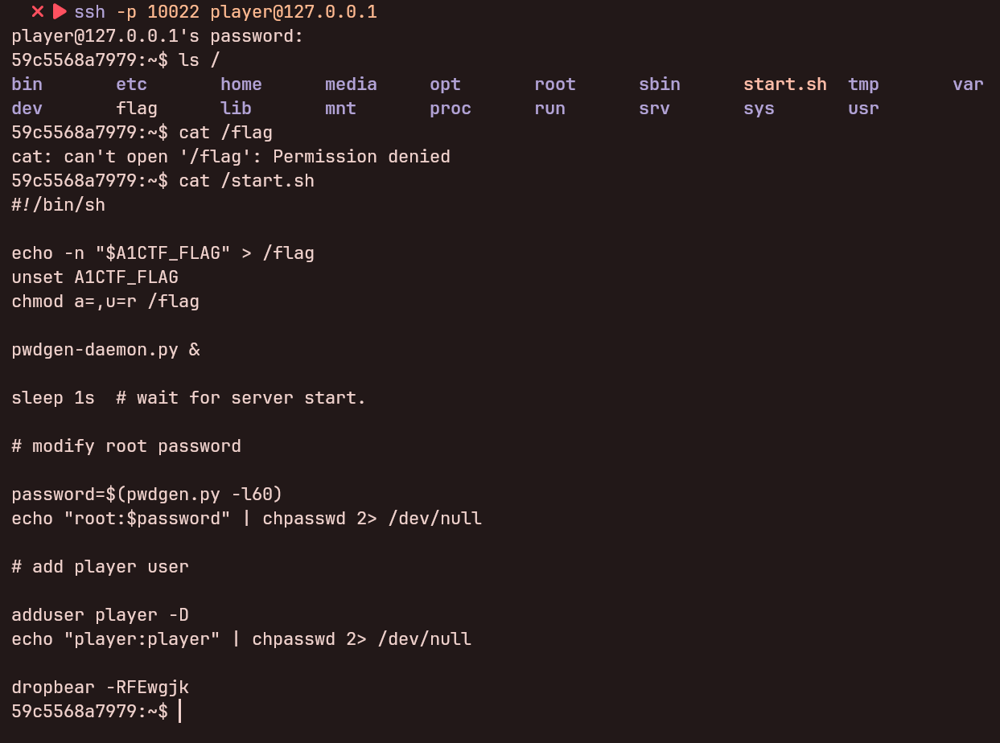
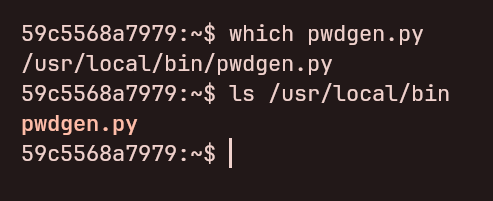
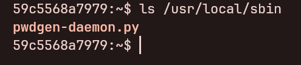
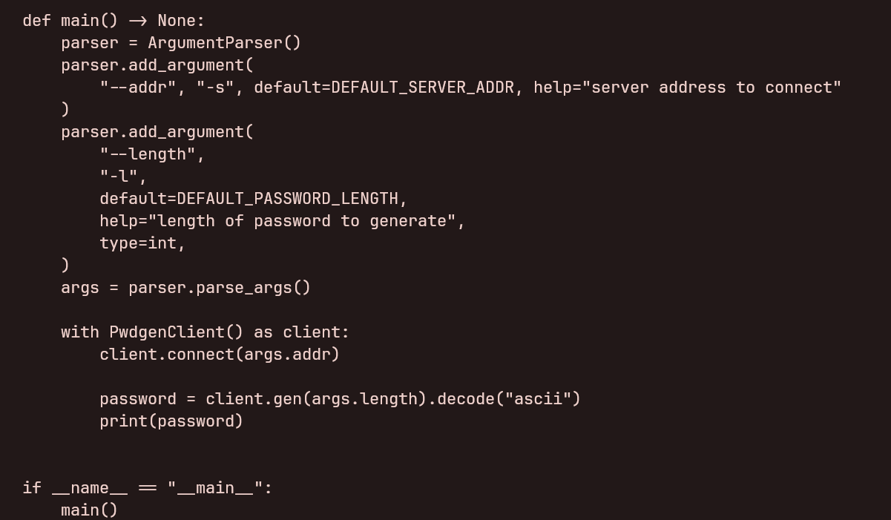
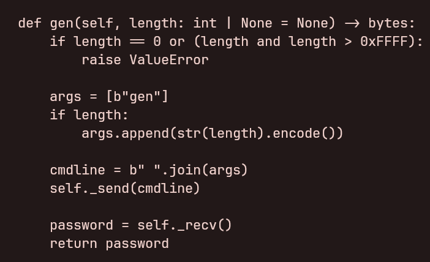
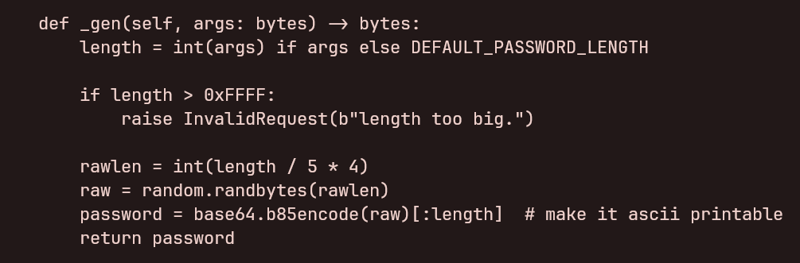
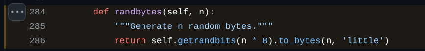
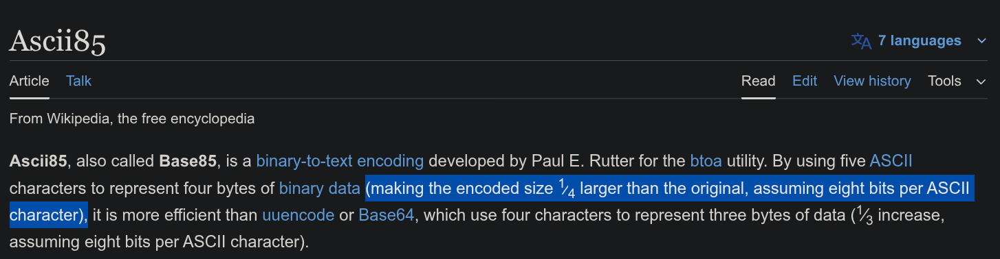

# secure-account

## 题目描述

各种服务器因弱密钥问题而被攻击的事件屡见不鲜……

为了解决密钥安全问题，rk 特地写了个密钥生成 Daemon 来提供统一生成密钥的接口，无论是什么应用都能通过 Unix Socket 与 Daemon 通信获得密钥。

另外 rk 还写了个脚本用来给用户可以很方便地直接通过 Shell 来获取密钥，并且用这个脚本给 root 换上了新密码。

但是，Phrinky 发现了其中有很大的漏洞，你看看你能发现吗？

> 请使用 SSH 客户端访问相应服务
> 
> 用户名: `player`
> 密码: `player`

## 引入

这道题其实在之前的几次 CTF 已经放出来过了，但是直到这一次都依然是零解 QwQ。

## 解题思路

使用 SSH 客户端连接到服务器后，可以看到根目录有 `flag` 和 `start.sh`，但是 `flag` 是打不开的 (显而易见的)，但是可以看到 `start.sh` 的内容:



按照题目描述可以知道，`pwdgen-daemon.py` 是 *提供统一生成密钥的接口* 的 Daemon。

然后待 Daemon 启动后运行了 `pwdgen.py` 并传入了参数 `-l60`。

这边可以通过 `which` 查询到 `pwdgen.py` 的真实路径:



而执行 `pwdgen-daemon.py` 可以发现 Permission denied:


按照 Linux FHS 的定义，结合上面获取到的 `pwdgen.py` 路径，可猜测 `pwdgen-daemon.py` 应该在 `/usr/local/sbin`:



先看到 `pwdgen.py` 的代码:



可以看到前面调用 `pwdgen.py` 脚本传入的 `-l` 参数是密码长度，他会直接把参数转入到 Daemon 里:



再看到 `pwdgen-daemon.py`:



会发现这边密码生成逻辑是直接调用了 `random` 库的函数，而 `random` 库提供的直接函数都是由 Python 的全局状态非密码学安全的随机数生成器生成的随机数，而 Python 所使用的随机数生成算法 *MT19937* 是有现成的脚本可恢复出状态的，意味着我们可以多次调用 Daemon 的生成密钥函数恢复出 Random 状态，从而恢复出 `root` 用户的密码。

根据 [Random.randbytes](https://github.com/python/cpython/blob/3.12/Lib/random.py#L284,L286) 的生成规则:



上面 `root` 用户生成密码使用的密码长度为 `60`，换算到 `rawlen` 为 `60 / 5 * 4 = 48`，对应 Bit Length 为 `48 * 8 = 384`，恰好能被 `32` 整除，而正好 *MT19937* 生成的一个随机数为 32-bit 的整数，恰好能直接对齐以便恢复状态。

另外此处使用的 *Base85* 编码会比原始数据长 `1/4` (所以上面会有个 `/ 5 * 4` 的运算):



此处密码长度为 `60` 恰好能被整除，意味着这边的生成的 `root` 用户密码是完整的 *Base85* 字符串。

恢复 *MT19937* 状态需要 624 个 32-bit Integer 随机数，而恰好可以通过 Daemon 生成 5 bytes 的密码，然后使用 *Base85* 解码，按照小端序 (见上面 `Random.randbytes` 的生成规则) 解析为整数型便为要求的 32-bit Integer 随机数，如此往复生成 624 次。

恢复出当前状态后，对 *MT19937* 向前推 624 + (60 / 5) 个状态后，生成 ((60 / 5) * 32) bits 并以小端序转换成 bytes，再通过 *Base85* 编码即可获得 `root` 用户密码。

这边将直接使用项目 [tna0y/Python-random-module-cracker](https://github.com/tna0y/Python-random-module-cracker/) 提供的 [randcrack.py](https://github.com/tna0y/Python-random-module-cracker/blob/92a127d1239a1ef6fa0b54aa6c1ff16e831c4028/randcrack/randcrack.py) 来进行解题。

将 `randcrack.py` 下载到容器里，并与以下脚本放在同一个目录下:

```python
from randcrack import RandCrack
import pwdgen
import base64

PASSWORD_BYTE_LENGTH = 60 // 5 * 4


def main() -> None:
    with pwdgen.PwdgenClient() as client:
        client.connect()

        crack = RandCrack()

        for _ in range(624):
            password = client.gen(5)  # 5-byte password encoded from 4-byte (32-bit) randbytes
            raw = base64.b85decode(password)
            num = int.from_bytes(raw, "little")
            crack.submit(num)

    crack.offset(-624)
    crack.offset(-(PASSWORD_BYTE_LENGTH // 4))

    num = crack.predict_getrandbits(PASSWORD_BYTE_LENGTH * 8)
    raw = num.to_bytes(PASSWORD_BYTE_LENGTH, "little")
    password = base64.b85encode(raw).decode("ascii")
    print(password)


if __name__ == "__main__":
    main()
```

将 `pwdgen.py` 链接到当前目录:

```shell
ln -s $(which pwdgen.py) pwdgen.py
```

执行脚本即可获得 `root` 用户密码，使用 `su` 也能提权成功:


在 `root` 用户下执行 `cat /flag` 即可获得 Flag:


