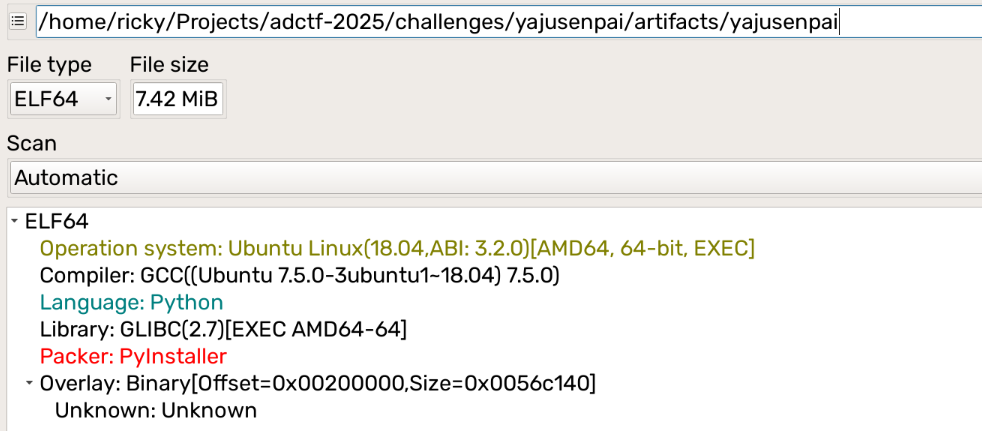
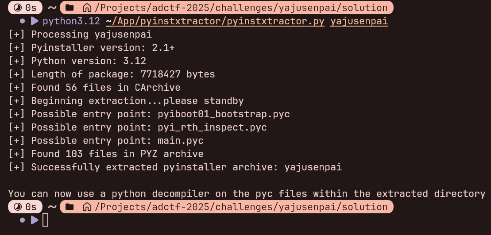
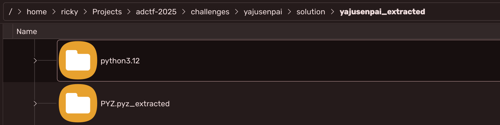
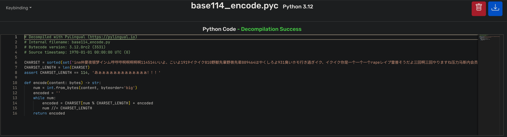
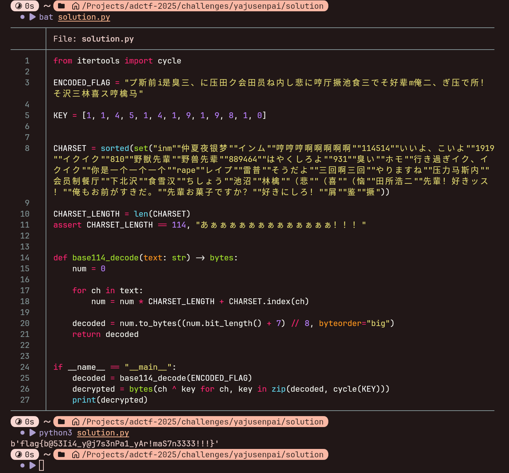

# 野兽先辈的呐喊

## 题目描述

哼哼哼，啊啊啊啊啊啊啊啊啊啊

作为 Homo (指人类) 的你可以做出来这道题的（赞许

## 解题思路

使用 DIE (Detect It Easy) 可以分析出是 PyInstaller 打包的 Python 应用:



使用 PyInstxtractor 解包 (注意需要使用 Python 3.12 (该程序使用 Python 3.12 打包，可通过 PyInstxtractor 输出判断)):



由于现有的很多 Python 反编译工具都不太支持高版本 Python，这边建议使用在线的反编译工具 https://www.pylingual.io/。

反编译出 `main.pyc` 可以看到:


首先程序对用户输入对 `KEY` 进行了异或加密处理，随后使用了 `base114_encode` 库提供的 `encode` 函数进行了编码处理。

`base114_encode` 库可以通过 PyInstxtractor 解压出目录下的 `PYZ.pyz_extracted` 获得:




再使用 PyLingual 对 `base114_encode.pyc` 反编译可以分析出 `encode` 函数的编码过程:



不难写出解码脚本:

```python
from itertools import cycle

ENCODED_FLAG = "プ斯前i是臭三、に压田ク会田员ね内し悲に哼厅撅池食三でそ好辈m俺二、ぎ压で所！そ沢三林喜ス哼檎马"
KEY = [1, 1, 4, 5, 1, 4, 1, 9, 1, 9, 8, 1, 0]

CHARSET = sorted(set("inm""仲夏夜银梦""インム""哼哼哼啊啊啊啊啊""114514""いいよ、こいよ""1919""イクイク""810""野獣先輩""野兽先辈""889464""はやくしろよ""931""臭い""ホモ""行き過ぎイク、イクイク""你是一个一个一个""rape""レイプ""雷普""そうだよ""三回啊三回""やりますね""压力马斯内""会员制餐厅""下北沢""食雪汉""ちしょう""池沼""林檎""（悲""（喜""（恼""田所浩二""先輩！好きッス！""俺もお前がすきだ。""先輩お菓子ですか？""好きにしろ！""屑""鉴""撅"))

CHARSET_LENGTH = len(CHARSET)
assert CHARSET_LENGTH == 114, "あぁぁぁぁぁぁぁぁぁぁぁぁぁ！！！"


def base114_decode(text: str) -> bytes:
    num = 0

    for ch in text:
        num = num * CHARSET_LENGTH + CHARSET.index(ch)

    decoded = num.to_bytes((num.bit_length() + 7) // 8, byteorder="big")
    return decoded


if __name__ == "__main__":
    decoded = base114_decode(ENCODED_FLAG)  # base114 decode
    decrypted = bytes(ch ^ key for ch, key in zip(decoded, cycle(KEY)))  # xor decrypt
    print(decrypted)
```

执行脚本可得到 Flag:



Flag 为: `flag{b@53Ii4_y@j7s3nPa1_yAr!maS7n3333!!!}`

> ~~这个 rk 设计出了这么臭的编码、这么臭的 Flag，大抵是不能要了吧（悲~~
