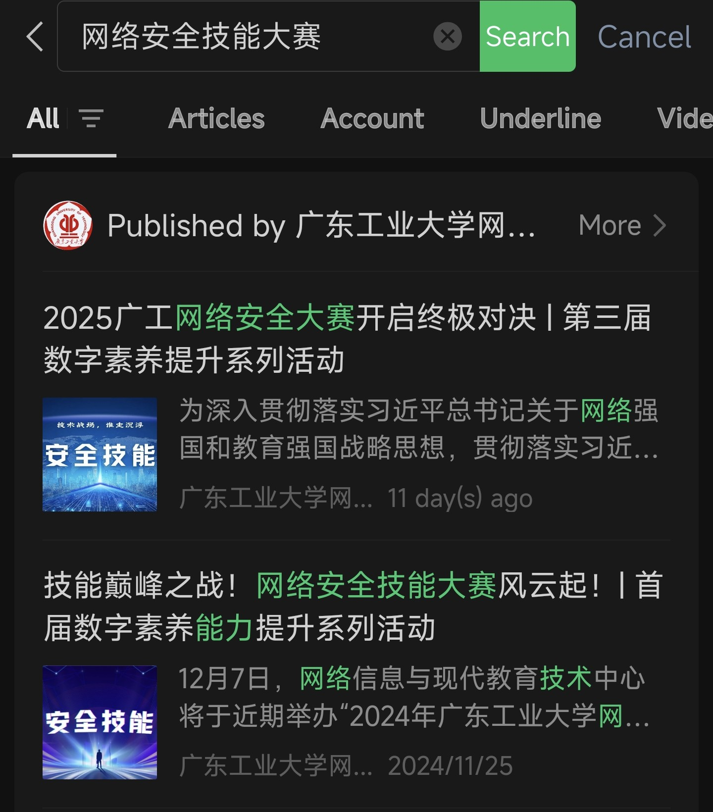
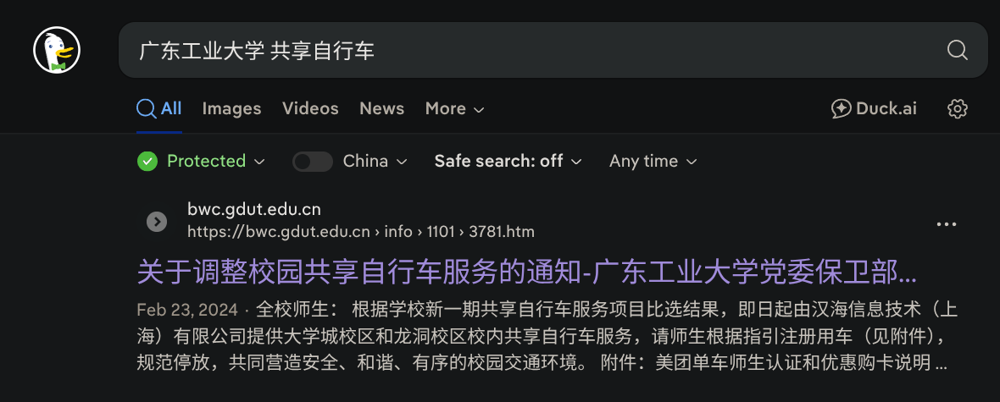
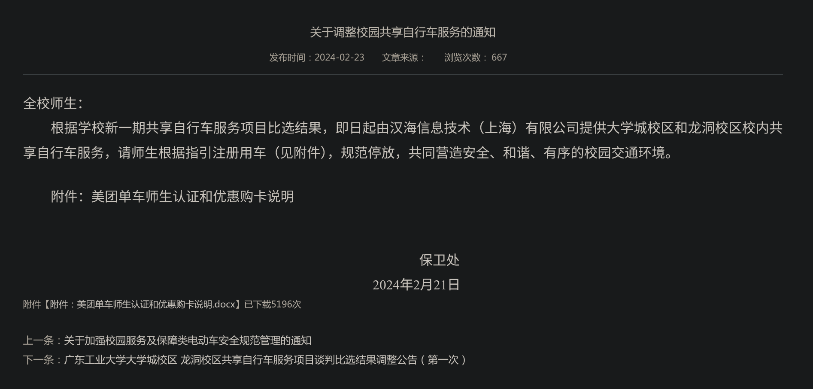
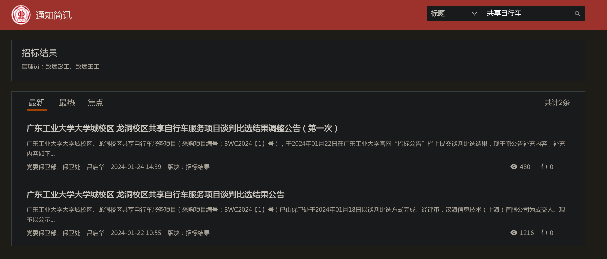
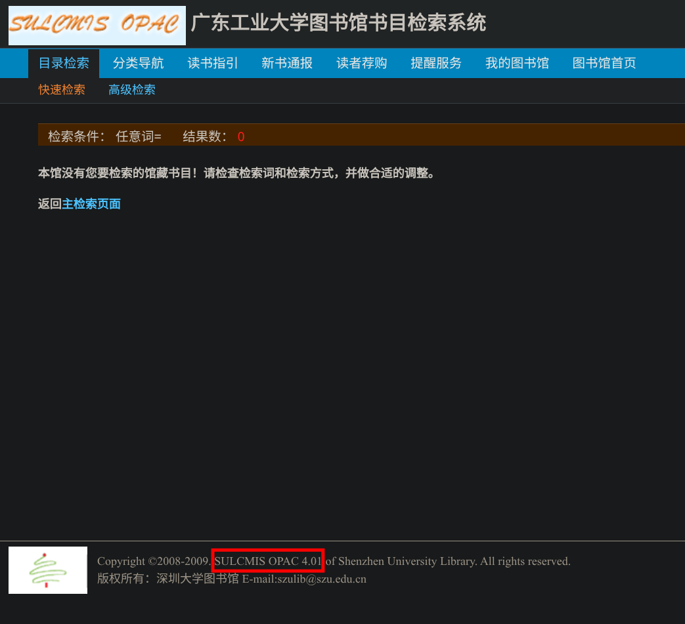

# 广工问答

## 题目描述

你了解窝工吗？来做做题检验一下你对学校的了解程度把～

## 解题思路

### 第一题

> 你知道 **首届广东工业大学网络安全技能大赛** 是什么时候举行的吗？请写出其 **正式比赛的开始时间和结束时间**。（开始时间和结束时间之间 **使用短横线 `-` 进行连接**，时间格式为 `YYYYmmddHHMM`，格式示例: `202507211145-202507211919`）

在 *广东工业大学网络中心* 微信公众号，通过检索关键词 `网络安全技能大赛` 可以检索到:

*技能巅峰之战！网络安全技能大赛风云起！| 首届数字素养能力提升系列活动* 这篇文章:

往下翻可以看到具体时间:

根据格式要求可确认答案为: `202412070900-202412071830`。

### 第二题

> 广东工业大学曾经的校园共享自行车服务提供商是 **哈啰**，被称作 **“哈啰工业大学”**（简称 **“哈工大”**），而现在校园共享自行车的业务被 **“美团单车”** 所包揽，~~也自然成为了 **“美团工业大学”**（简称 **“美工大”**）~~。那么你知道 **广东工业大学保卫处** 是什么时候与 **“美团单车”** 以谈判比选方式 **成交共享自行车服务项目** 的吗？请写出 **成交日期**。（日期格式为 `YYYYmmdd`，格式示例: `20250815`）
> 
> 

使用关键词 `广东工业大学 共享自行车` 在搜索引擎检索可以找到以下 [通知](https://bwc.gdut.edu.cn/info/1101/3781.htm):

可以看到下面的 “下一条” 链接 *[广东工业大学大学城校区 龙洞校区共享自行车服务项目谈判比选结果调整公告（第一次）](https://bwc.gdut.edu.cn/info/1101/3779.htm)*:

根据指引找到 “招标公告” 处，找到右侧的 “招标结果” 点开 “更多” 以搜索相关信息:

检索关键词 `共享自行车` 可以找到以下结果:

看到公告 *[广东工业大学大学城校区 龙洞校区共享自行车服务项目谈判比选结果公告](https://oas.gdut.edu.cn/seeyon/newsData.do?method=newsView&newsId=8209283887436088484)*:

可以确认以谈判比选方式成交共享自行车服务项目时间为 2024 年 1 月 18 日。

根据格式要求可确认答案为: `20240118`。

### 第三题

> 你知道 **广东工业大学图书馆** 所使用的 **书目检索系统** 是什么吗？请写出 **其系统名称及版本号**。（系统名称和版本号之间用 **空格隔开**，系统名称之间的 **空格使用短横线 `-` 连接**，格式示例: `Awesome-Library-Management-System 1.0`）

打开 *[广东工业大学图书馆](https://library.gdut.edu.cn/)* 官网，找到下面的 *馆藏查询*:

任意输入内容进入检索系统:

可以看到下方的系统名称和版本号 *SULCMIS OPAC 4.01*。

根据格式要求可确认答案为: `SULCMIS-OPAC 4.01`。

### 第四题

> 激情全运会，活力大湾区”。你知道广东工业大学 **（非志愿者）有多少名学生以及有多少名老师** 参加了 **全运会** 吗？请分别写出 **参与学生人数和参与老师人数**。（两者之间使用空格分隔开，格式示例: `11 4`）
> 
> 
> 
> ~~（白切鸡和玫瑰豉油鸡）~~

在 *广东工业大学* 微信公众号可以翻到下面这篇 [文章](https://mp.weixin.qq.com/s/CWZ4KeiARDsXnb1DHjrBnQ):

往下翻可以看到具体人数:

根据格式要求可确认答案为: `9 4`。
